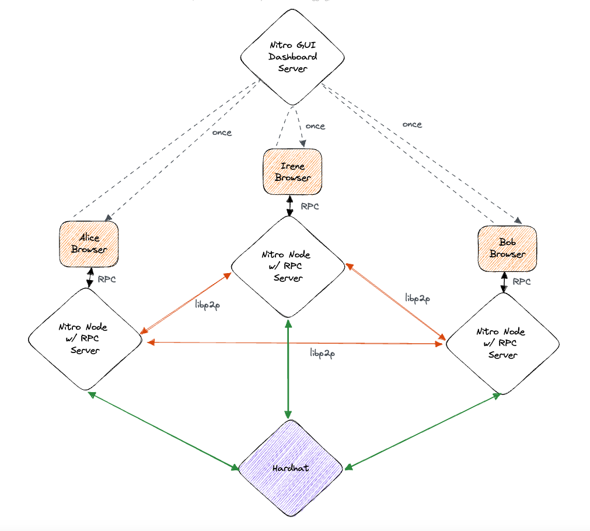

# Nitro-GUI Monorepo

This repo contains work toward a web UI for a [nitro](https://github.com/statechannels/go-nitro) powered statechannel network.

UI component demos deployed here: https://nitro-storybook.netlify.app/

## Packages

- package [`site`](./packages/site) contains the web UI
- package [`nitro-rpc-client`](./packages/nitro-rpc-client) contains a typescript library (and CLI tool) for communicating with go-nitro's RPC api. 

## Storybook

Components can be viewed by running `yarn storybook` or `npm run storybook` from the `packages/site` directory.

## Running manual integration tests

You will need to spin up:

- a local `hardhat network` instance running with default settings
- a GUI/Dashboard server (x1) `yarn dev` in the `site` package
- `n` browser tabs loading the GUI from the above server (try `n=3` for example, Alice/Irene/Bob in the below diagram)
- `n` `go-nitro` RPC servers ("Nitro as a Service") `go run .` in http://github.com/statechannels/go-nitro. See the readme of that repo for more information. Servers will each require:

  - unique message port
  - unique rpc port
  - unique channel signing key (a funded account on hardhat will be selected automatically)

And then drive the network by clicking on a button in the dashboard of one of the participants.

The interactions are shown in this diagram:

